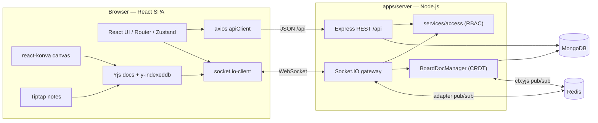

<div align="center">

# 🧩 CollabBoard

### Real-time collaborative whiteboard + meeting-notes platform

A Miro-style multiplayer canvas with a live rich-text notes editor, presence, version
history, AI action-items, PDF export, and read-only public sharing — built on a
conflict-free CRDT core that survives offline edits and scales horizontally.

[Architecture](docs/ARCHITECTURE.md) ·
[Data model](docs/DATA_MODEL.md) ·
[Realtime protocol](docs/REALTIME.md) ·
[Security](docs/SECURITY.md) ·
[REST API](docs/API.md) ·
[Testing](docs/TESTING.md) ·
[Deployment](docs/DEPLOYMENT.md)

</div>

---

## 🎥 Demo

> **🔗 Live app:** **https://collabboard-3qtp.onrender.com** — sign in with `alice@demo.dev` / `Password123!`
> _(free tier; the first request after ~15 min idle takes ~30–50 s to wake up.)_
>
> **Loom walkthrough:** _<!-- paste your Loom/YouTube link here -->_ `https://www.loom.com/share/<id>`

| Dashboard | Board (canvas + notes) | Presence & sharing |
|---|---|---|
| _screenshot placeholder_ | _screenshot placeholder_ | _screenshot placeholder_ |

Demo accounts (all password `Password123!`): `alice@demo.dev` (owner), `bob@demo.dev` (editor),
`carol@demo.dev` (viewer). Or run locally with [`docker compose up --build`](#-quickstart) → http://localhost:8080.

---

## ✨ Features

Mapped to the assignment brief. Everything below is backed by code in this repo — see the
linked docs for the how.

### Mandatory

- **Authentication** — email/password with JWT access tokens + rotating **httpOnly refresh
  cookies**, bcrypt hashing, and email verification (dev = console mailer). → [SECURITY](docs/SECURITY.md)
- **Workspaces & boards** — full CRUD, workspace membership, and a board list with
  server-side **search (title + owner name), star filter, sorting, and pagination** built
  from a single indexed aggregation (no N+1). → [API](docs/API.md)
- **Real-time collaborative canvas** — multiplayer freehand pen, shapes, lines/arrows,
  text, and sticky notes on a `react-konva` stage, backed by a **Yjs CRDT** so concurrent
  edits merge conflict-free. → [REALTIME](docs/REALTIME.md)
- **Live presence** — cursors and avatars for everyone in a board, adapter-aware across
  server nodes. → [REALTIME](docs/REALTIME.md#presence)
- **Collaborative meeting notes** — a Tiptap rich-text editor bound to a second Yjs
  document, with multiplayer selection carets via awareness.
- **Role-based access control** — `viewer < editor < owner`, enforced by one central
  `services/access` module for **both REST and socket** paths; role changes and kicks are
  pushed to live sockets instantly. → [SECURITY](docs/SECURITY.md#authorization-matrix)

### Advanced / stretch

- **Version history** — an **append-only op-log compacted into periodic snapshots**;
  restore-to-snapshot fans a convergence diff out to every connected client with no reload.
  → [DATA_MODEL](docs/DATA_MODEL.md#op-log-vs-snapshot)
- **Offline-first** — each board's Yjs docs persist to **IndexedDB**; edits made offline
  are merged automatically on reconnect. → [REALTIME](docs/REALTIME.md#offline--resync)
- **AI action-items** — extract owners/dates/tasks from the notes via a pluggable service
  (`AI_SERVICE_URL`) with a deterministic in-process mock fallback (`mock-llm-v1`).
- **PDF export** — a server-generated meeting summary (notes + action items + embedded
  canvas PNG) via PDFKit.
- **Public share links** — tokenised, optionally expiring, revocable read-only board views.
- **Horizontal scaling** — Socket.IO **Redis adapter** for room fan-out plus a Redis
  **pub/sub channel** that converges every node's in-memory CRDT. → [ARCHITECTURE](docs/ARCHITECTURE.md#horizontal-scaling)

---

## 🛠 Tech stack

| Layer | Choices |
|---|---|
| **Language** | TypeScript (strict, ESM) across the whole monorepo |
| **Shared** | `@collabboard/shared` — domain types, DTOs, socket protocol, Zod schemas, constants |
| **Frontend** | React 18, Vite 6, React Router 6, Zustand, Tailwind CSS, `react-konva`/Konva, Tiptap 2, Yjs + `y-indexeddb` + `y-protocols` + `y-prosemirror`, axios, `socket.io-client`, lucide-react |
| **Backend** | Node 20, Express 4, Socket.IO 4, Mongoose 8, Yjs, `jsonwebtoken`, `bcryptjs`, `helmet`, `cors`, `cookie-parser`, `express-rate-limit`, Pino, Nodemailer, PDFKit, Zod |
| **Data / infra** | MongoDB 7, Redis 7 (optional — single-node without it), `@socket.io/redis-adapter` + `ioredis` |
| **Build / test** | `tsup` + `tsx` (server), Vite (web), Vitest + Supertest + `mongodb-memory-server` + `socket.io-client` |
| **Delivery** | Docker + Docker Compose, multi-stage images, nginx SPA host |

---

## 🗂 Monorepo layout

npm workspaces — `packages/*` and `apps/*`.

```
opas-software-interview-challenge/
├── packages/
│   └── shared/            @collabboard/shared — the frozen cross-cutting contract
│       └── src/
│           ├── constants.ts        roles, doc/shape types, limits, presence colors
│           ├── types/domain.ts     User, Board, Note, Snapshot, CanvasElement, …
│           ├── types/dto.ts        request/response DTOs + ApiError envelope
│           ├── socket/events.ts    Socket.IO event names + payload types
│           └── schemas/index.ts    Zod runtime guards
├── apps/
│   ├── server/            Express + Socket.IO API (apps/server/src)
│   │   ├── config/         env, db, redis, logger
│   │   ├── models/         Mongoose schemas (12 collections)
│   │   ├── middleware/     requireAuth, validate, rateLimit, error
│   │   ├── services/       access (authz), serialize (doc→DTO), ai
│   │   ├── realtime/       gateway, BoardDocManager (CRDT engine), presence
│   │   ├── modules/        auth · workspaces · invitations · boards · public
│   │   └── routes/index.ts feature-router barrel mounted under /api
│   └── web/               React SPA (apps/web/src)
│       ├── lib/            apiClient, socket, yjsBoard (client CRDT), env
│       ├── stores/         Zustand auth + board UI state
│       ├── api/            typed REST clients (the server's client contract)
│       ├── components/     ui, canvas, notes, board, presence, layout
│       └── pages/          Login, Register, Dashboard, Board, Share, …
├── docs/                  this documentation set + BUILD_SPEC.md (the contract)
├── docker-compose.yml     mongo + redis + server + web
└── package.json           workspace scripts
```

---

## 🏗 Architecture at a glance



Full write-up, plus a real-time-edit sequence diagram and the scaling story, in
**[docs/ARCHITECTURE.md](docs/ARCHITECTURE.md)**.

---

## 🚀 Quickstart

### Option A — Docker (one command)

Requires Docker Desktop.

```bash
docker compose up --build
```

This starts **MongoDB**, **Redis**, the **server** (`:4000`), and the **web app** behind
nginx (`:8080`).

- Web app → http://localhost:8080
- API health → http://localhost:4000/health

Then seed demo data (see [Demo credentials](#-demo-credentials)):

```bash
npm run seed          # or: docker compose exec server npm run seed -w @collabboard/server
```

Tear down (and wipe volumes) with `docker compose down -v`.

### Option B — Manual dev

Requires Node ≥ 20, plus a local MongoDB (Redis optional).

```bash
# 1. install every workspace
npm install

# 2. configure env
cp .env.example .env         # defaults work out of the box for local dev

# 3. seed demo users + boards
npm run seed

# 4. run server (:4000) + web (:5173) together
npm run dev
```

Open http://localhost:5173. Leave `REDIS_URL` empty in `.env` to run **single-node** (no
adapter / pub/sub); set it to run the multi-node code paths locally.

---

## 🔐 Environment variables

From [`.env.example`](.env.example). Sensible defaults ship in `config/env.ts`, so local
dev boots with zero configuration.

| Variable | Scope | Default | Purpose |
|---|---|---|---|
| `NODE_ENV` | shared | `development` | `development` \| `test` \| `production` |
| `PORT` | server | `4000` | API + Socket.IO port |
| `CLIENT_URL` | server | `http://localhost:5173` | CORS origin + base for email/share links |
| `MONGO_URI` | server | `mongodb://localhost:27017/collabboard` | MongoDB connection |
| `REDIS_URL` | server | _(empty)_ | Redis for adapter + pub/sub. **Empty ⇒ single-node.** |
| `JWT_ACCESS_SECRET` | server | dev secret | HS256 secret for 15-min access tokens |
| `JWT_REFRESH_SECRET` | server | dev secret | HS256 secret for 7-day refresh tokens |
| `JWT_ACCESS_TTL` | server | `15m` | Access-token lifetime |
| `JWT_REFRESH_TTL` | server | `7d` | Refresh-token lifetime + cookie `maxAge` |
| `COOKIE_NAME` | server | `cb_refresh` | Refresh-cookie name |
| `COOKIE_DOMAIN` | server | `localhost` | Refresh-cookie domain |
| `COOKIE_SECURE` | server | `false` | `true` in production (HTTPS-only cookie) |
| `EMAIL_FROM` | server | `CollabBoard <no-reply@collabboard.dev>` | From address |
| `SMTP_HOST` / `SMTP_PORT` / `SMTP_USER` / `SMTP_PASS` | server | _(empty)_ | Real SMTP. Empty ⇒ emails log to console. |
| `AI_SERVICE_URL` | server | _(empty)_ | External action-item service. Empty ⇒ in-process mock. |
| `SHARE_LINK_SECRET` | server | dev secret | Salt for share-link hashing |
| `VITE_API_URL` | web | `http://localhost:4000` | REST base URL (build-time) |
| `VITE_SOCKET_URL` | web | `http://localhost:4000` | Socket.IO URL (build-time) |

---

## 📜 npm scripts

Run from the repo root.

| Script | What it does |
|---|---|
| `npm run dev` | Server + web together (`concurrently`) |
| `npm run dev:server` / `npm run dev:web` | Run one side only |
| `npm run build` | Build server (`tsup`) then web (`vite build`) |
| `npm run typecheck` | `tsc --noEmit` across server + web |
| `npm run lint` | ESLint over `.ts`/`.tsx` |
| `npm run format` | Prettier write |
| `npm test` | Server test suite (Vitest) |
| `npm run test:web` | Web test suite (Vitest + jsdom) |
| `npm run seed` | Idempotent demo data |
| `npm run docker:up` / `docker:down` | Compose up (build) / down (volumes) |

---

## 👤 Demo credentials

Created by `npm run seed` (idempotent — it clears and re-seeds). All accounts share the
password **`Password123!`** and are pre-verified.

| Email | Role on seeded boards |
|---|---|
| `alice@demo.dev` | **owner** |
| `bob@demo.dev` | **editor** |
| `carol@demo.dev` | **viewer** |

The seed creates one workspace, two boards (with the memberships above), a starter note,
a couple of canvas elements, and an initial snapshot — enough to demo presence, RBAC, and
version history immediately.

---

## 🔌 API & realtime overview

- **REST** — everything under `/api`, JSON, Bearer access token. Grouped routers:
  `/auth`, `/workspaces`, `/invitations`, `/boards`, `/public`. Full reference:
  **[docs/API.md](docs/API.md)**.
- **Realtime** — a single authenticated Socket.IO connection per client. Yjs updates travel
  as base64 strings; every board-scoped event is re-authorized server-side. Full protocol
  table + sync/presence/offline flows: **[docs/REALTIME.md](docs/REALTIME.md)**.
- A ready-to-run **Postman collection** (`postman/`) covers the auth flow (with token
  capture), board CRUD, sharing, and AI.

---

## 🧪 Testing

```bash
npm test          # server: auth, boards (search/star/sort/pagination), RBAC, realtime
npm run test:web  # web unit tests (jsdom)
```

Integration tests run against an in-memory MongoDB (`mongodb-memory-server`) via Supertest,
and the realtime suite drives **two live `socket.io-client` peers** through a real HTTP +
Socket.IO server. Details and coverage map: **[docs/TESTING.md](docs/TESTING.md)**.

---

## 📚 Documentation

| Doc | Contents |
|---|---|
| [ARCHITECTURE.md](docs/ARCHITECTURE.md) | Components, data flow, real-time sequence, horizontal scaling |
| [DATA_MODEL.md](docs/DATA_MODEL.md) | Every collection, fields, indexes, ER diagram, op-log-vs-snapshot |
| [REALTIME.md](docs/REALTIME.md) | Socket protocol table, Yjs sync, presence, awareness, offline re-sync |
| [SECURITY.md](docs/SECURITY.md) | Auth, authorization matrix, socket auth, rate limiting, threats |
| [API.md](docs/API.md) | REST reference grouped by resource |
| [TESTING.md](docs/TESTING.md) | How to run, what's covered, realtime approach |
| [DEPLOYMENT.md](docs/DEPLOYMENT.md) | Docker/compose, env, production & scaling notes |
| [BUILD_SPEC.md](docs/BUILD_SPEC.md) | The authoritative implementation contract |

---

## ✅ What's implemented / ⚠️ known limitations

**Implemented**

- Monorepo with a **frozen shared contract** (types + DTOs + socket protocol + Zod schemas)
  that makes a renamed event or changed shape a compile error on both sides.
- JWT access + **rotating** refresh-cookie auth, bcrypt, email verification, single-flight
  token refresh on the client.
- Workspaces, boards, memberships, invitations, and RBAC through one central access service.
- Board list with indexed search / star / sort / pagination.
- Two-document (canvas + notes) Yjs CRDT with an **op-log + snapshot** persistence engine,
  log compaction, idle unload, and restore-to-snapshot convergence.
- Presence (cursors/avatars), Tiptap awareness carets, and offline IndexedDB re-sync.
- AI action-items (mock + pluggable), PDF export, and revocable public share links.
- Redis adapter + pub/sub for horizontal scaling; graceful single-node fallback.
- Docker Compose stack and multi-stage production images.

**Known limitations / trade-offs**

- **AI is a deterministic heuristic** (`mock-llm-v1`) unless `AI_SERVICE_URL` points at a
  real service — by design, so the feature works offline and in CI.
- **Email** logs to the console in dev; wire `SMTP_*` for real delivery.
- Canvas primitives cover pen/shapes/text/sticky — no images, grouping, or multi-select
  transforms yet.
- Snapshots keep full board history; there is no retention/GC policy beyond op-log
  compaction, so long-lived boards accumulate snapshot rows.
- Presence de-dupes to one entry per user (most-recent socket wins), so a user's two tabs
  show as one cursor.
- Access tokens are stateless (revocation is via short TTL + refresh rotation, not a
  server-side denylist).

---

<div align="center">
Built as a software engineering interview challenge. See <a href="docs/BUILD_SPEC.md">BUILD_SPEC.md</a> for the full contract.
</div>
