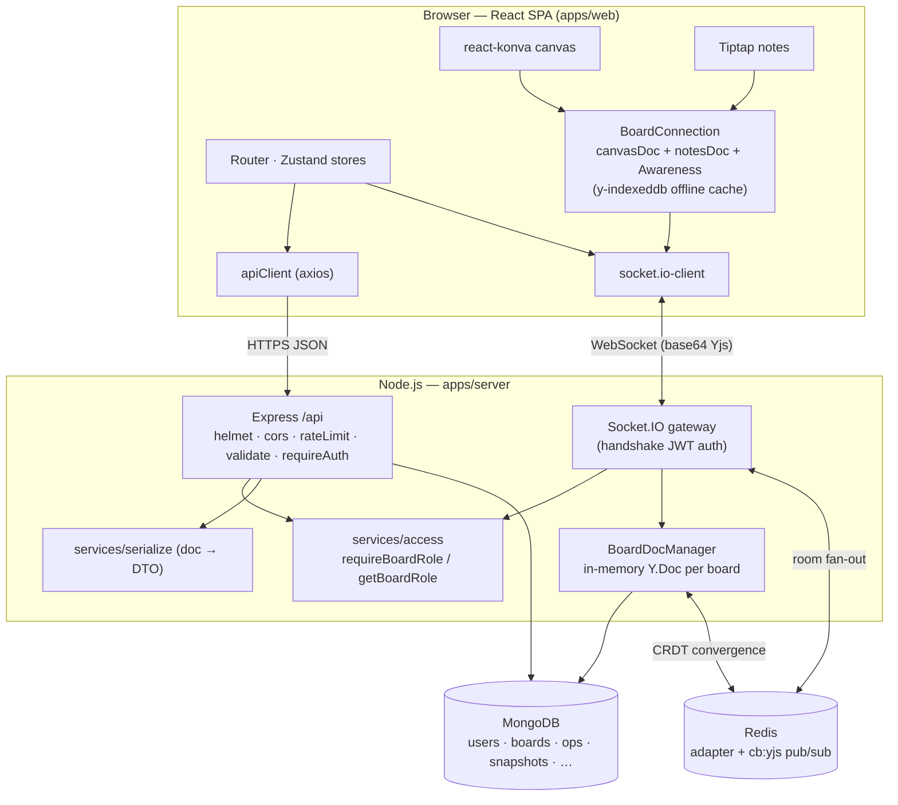
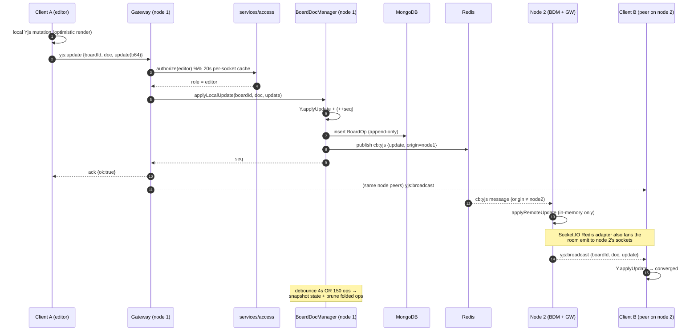
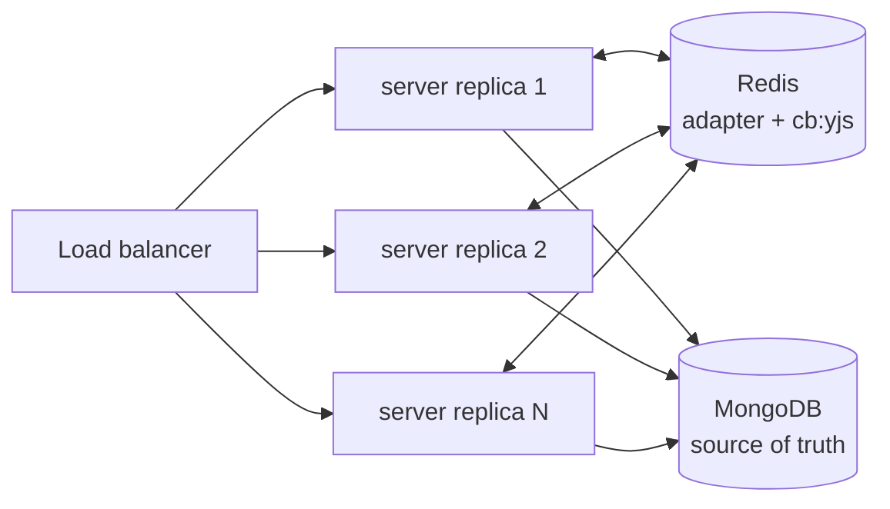

# Architecture

CollabBoard is a TypeScript monorepo (npm workspaces) with three deployable units and two
data stores. This document explains the components, how a real-time edit flows end to end,
and how the system scales horizontally.

- [Components](#components)
- [Data flow](#data-flow)
- [System diagram](#system-diagram)
- [Real-time edit sequence](#real-time-edit-sequence)
- [The CRDT engine (BoardDocManager)](#the-crdt-engine-boarddocmanager)
- [Horizontal scaling](#horizontal-scaling)

---

## Components

| Component | Where | Responsibility |
|---|---|---|
| **Web (SPA)** | `apps/web` | React 18 + Vite. Renders the dashboard, the Konva canvas, and the Tiptap notes editor. Owns the **client-side CRDT** (`lib/yjsBoard.ts`) and one shared authenticated socket (`lib/socket.ts`). Served in production by nginx. |
| **Server (API + gateway)** | `apps/server` | Express REST API under `/api` and the Socket.IO gateway. Hosts the authoritative in-memory CRDT (`BoardDocManager`), all authorization (`services/access`), and persistence. |
| **Shared contract** | `packages/shared` | Domain types, DTOs, the Socket.IO event protocol, Zod schemas, and constants — imported by **both** apps so the wire format is a single source of truth. |
| **MongoDB** | `mongo:7` | Durable store: users, workspaces, boards, memberships, the append-only op-log, snapshots, notes projection, invitations, share links. |
| **Redis** | `redis:7` | Optional. Backs the Socket.IO adapter (cross-node room fan-out) and a pub/sub channel (`cb:yjs`) that converges every node's in-memory Y.Docs. Absent ⇒ single-node. |

The server is deliberately layered so the CRDT engine never touches sockets and the gateway
never hand-rolls a role check:

```
HTTP  ─▶ app.ts ─▶ routes/index.ts ─▶ modules/*/**.routes ─▶ controller
                                                              │
Socket ─▶ realtime/gateway.ts ──────────────────────────────┤
                                                              ▼
                                     services/access (RBAC) ─┬─ services/serialize (DTOs)
                                     realtime/BoardDocManager ┘   models/* (Mongoose)
```

---

## Data flow

**REST request.** `apiClient` (axios) attaches the in-memory Bearer access token → Express
`apiLimiter` → feature router → `validate(schema)` → `requireAuth` → controller. The
controller authorizes through `services/access`, reads/writes Mongoose models, and maps
documents to shared DTOs via `services/serialize` before responding. A `401` triggers a
**single-flight refresh** on the client, then one automatic retry.

**Realtime edit.** The client mutates a Yjs doc locally (instant, optimistic). A `doc.on
('update')` handler emits `yjs:update` over the shared socket. The gateway re-authorizes,
hands the update to `BoardDocManager`, which applies it in memory, appends it to the op-log,
publishes it to sibling nodes over Redis, and schedules snapshot compaction. The gateway
broadcasts `yjs:broadcast` to every other socket in the board room. See the
[sequence diagram](#real-time-edit-sequence).

**Board load.** On `board:join` the gateway returns the full base64 state of both
sub-documents (`canvas`, `notes`) plus the presence list. `BoardDocManager` produces that
state by hydrating from **the latest snapshot + only the ops recorded since** — a bounded,
fast reconstruction regardless of a board's lifetime edit count.

---

## System diagram



---

## Real-time edit sequence

A single pen stroke or keystroke by an **editor**, with a peer on a **different server node**:



Two independent fan-out mechanisms cooperate: the **Socket.IO Redis adapter** delivers the
`yjs:broadcast` room emit to sockets on other nodes, while the **`cb:yjs` pub/sub channel**
keeps each node's *authoritative in-memory Y.Doc* converged so a late joiner on any node
bootstraps from correct state. Only the originating node persists the op (`origin` guard),
so there is exactly one op-log row per update.

---

## The CRDT engine (BoardDocManager)

`realtime/BoardDocManager.ts` owns one in-memory `Y.Doc` per `(board, doc)` pair and is the
only writer to the op-log and snapshots. Responsibilities:

1. **Hydrate** a board on first use from `latest snapshot + ops-since` (fast load).
2. **Apply + persist** each client update as an append-only `BoardOp`.
3. **Compact** — debounce full-state snapshots (4 s idle, or every 150 ops) and delete ops
   already folded into the snapshot, keeping the log bounded.
4. **Converge** sibling nodes over Redis pub/sub for horizontal scale.
5. **Reference-count** active boards (`acquire`/`release`) and **unload** idle ones after
   5 minutes (snapshotting first), bounding memory.

It never imports Socket.IO — the gateway owns all client I/O — which keeps the CRDT engine
unit-testable in isolation. The client mirror (`apps/web/src/lib/yjsBoard.ts`) is symmetric:
two Yjs docs + awareness, persisted to IndexedDB, relayed over the same socket.

Key constants (in `BoardDocManager.ts`): `SNAPSHOT_DEBOUNCE_MS = 4000`,
`OPS_PER_SNAPSHOT = 150`, `IDLE_UNLOAD_MS = 5 min`, Redis channel `cb:yjs`.

---

## Horizontal scaling

The system runs correctly on a single node **and** across N replicas behind a load balancer.

**1. Socket fan-out — Socket.IO Redis adapter.** `createSocketServer` calls
`io.adapter(createAdapter(pub, sub))` when `REDIS_URL` is set. Room emits (`board:<id>`,
`user:<id>`) reach sockets on every node, so presence and broadcasts are node-agnostic.
`presenceSnapshot` uses `io.in(room).fetchSockets()`, which the adapter makes cluster-wide.

**2. CRDT convergence — `cb:yjs` pub/sub.** The adapter forwards *socket messages*, but each
node also holds its own authoritative in-memory `Y.Doc`. `BoardDocManager` publishes every
applied update to the `cb:yjs` channel; peers apply it **in memory only** (no re-persist),
guarded by an `origin` node id so a node ignores its own echo. A node that doesn't currently
hold a board simply skips the message and rehydrates from MongoDB (`snapshot + ops`) the next
time someone joins there — **MongoDB is the source of truth**.

**3. Stateless request tier.** REST is stateless (JWT Bearer); the refresh cookie is verified
against the shared `RefreshToken` collection, so any replica can serve any request. Sticky
sessions are **not** required.

**Single-node fallback.** With `REDIS_URL` empty, `getRedisClients()` returns `null`: no
adapter, no pub/sub, and `BoardDocManager` logs "single-node mode." The exact same code paths
run — Redis is a scale-out add-on, not a hard dependency — which keeps local dev and CI light.



See [DATA_MODEL.md](DATA_MODEL.md) for the op-log-vs-snapshot rationale and
[REALTIME.md](REALTIME.md) for the wire protocol.
