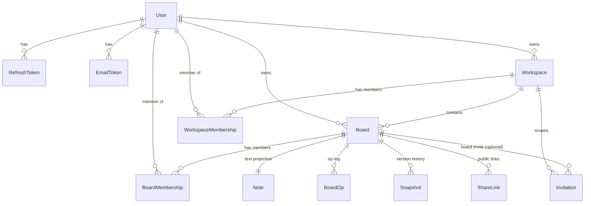

# Data model

MongoDB via Mongoose 8. Twelve collections. Every schema uses a shared `toJSON` transform
(`models/_helpers.ts`) that renames `_id → id`, drops `__v`, and **strips secrets**
(`passwordHash`, `tokenHash`, raw `update`/`state` buffers) so documents map cleanly onto the
shared DTO types in `packages/shared`.

- [ER diagram](#er-diagram)
- [Collections](#collections)
- [Op-log vs snapshot](#op-log-vs-snapshot)
- [Board-load performance](#board-load-performance)
- [Index summary](#index-summary)

---

## ER diagram



`WorkspaceMembership` and `BoardMembership` are **normalized join collections** (one row per
`(scope, user)`), not embedded arrays. That is what makes "boards/workspaces for a user"
cheap and indexable, and it is the access list the API and gateway authorize against.

---

## Collections

Field types below are the Mongoose/Mongo types. `→ id` marks fields the DTO transform renames
or omits. All `ObjectId` fields are references (`ref`).

### User — `models/User.ts`

| Field | Type | Notes |
|---|---|---|
| `email` | String | required, **unique**, lowercased, trimmed, indexed |
| `name` | String | required |
| `passwordHash` | String | required — **stripped** from JSON |
| `avatarColor` | String | assigned on save from `colorForId(_id)` if empty |
| `emailVerified` | Boolean | default `false` |
| `createdAt` / `updatedAt` | Date | timestamps |

Pre-save hook assigns a deterministic avatar color. DTO: `User` / `Me`.

### RefreshToken — `models/AuthToken.ts`

Rotating refresh tokens, **stored hashed** so a DB leak cannot mint sessions.

| Field | Type | Notes |
|---|---|---|
| `user` | ObjectId → User | required, indexed |
| `jti` | String | required, **unique** — the rotating token id |
| `tokenHash` | String | required — `sha256(token)` |
| `expiresAt` | Date | required — **TTL index** (`expireAfterSeconds: 0`) auto-purges |
| `revokedAt` | Date \| null | default `null`; set on rotation/logout |
| `userAgent` / `ip` | String | optional audit fields |
| `createdAt` | Date | timestamp (no `updatedAt`) |

### EmailToken — `models/AuthToken.ts`

Single-use tokens for email verification / password reset.

| Field | Type | Notes |
|---|---|---|
| `user` | ObjectId → User | required, indexed |
| `tokenHash` | String | required, indexed |
| `type` | `'verify' \| 'reset'` | required |
| `expiresAt` | Date | required — **TTL index** |
| `createdAt` | Date | timestamp |

### Workspace — `models/Workspace.ts`

| Field | Type | Notes |
|---|---|---|
| `name` | String | required, trimmed |
| `owner` | ObjectId → User | required, indexed |
| `createdAt` / `updatedAt` | Date | timestamps |

### WorkspaceMembership — `models/Workspace.ts`

| Field | Type | Notes |
|---|---|---|
| `workspace` | ObjectId → Workspace | required, indexed |
| `user` | ObjectId → User | required, indexed |
| `role` | `viewer \| editor \| owner` | required |
| `createdAt` / `updatedAt` | Date | timestamps |

Compound **unique** index `{ workspace, user }` — one membership per user per workspace.

### Board — `models/Board.ts`

| Field | Type | Notes |
|---|---|---|
| `workspace` | ObjectId → Workspace | required, indexed |
| `title` | String | required, trimmed — **text index** |
| `owner` | ObjectId → User | required, indexed |
| `isArchived` | Boolean | default `false` |
| `thumbnail` | String \| null | data-URL captured on save; default `null` |
| `createdAt` / `updatedAt` | Date | timestamps |

`{ title: 'text' }` powers title search; owner-name search is resolved via aggregation
(`$lookup` on the owner), not a text index.

### BoardMembership — `models/Board.ts`

Per-user board state: role + star + last-opened. **This is what makes the board list cheap.**

| Field | Type | Notes |
|---|---|---|
| `board` | ObjectId → Board | required, indexed |
| `workspace` | ObjectId → Workspace | required, indexed (denormalized) |
| `user` | ObjectId → User | required, indexed |
| `role` | `viewer \| editor \| owner` | required |
| `starred` | Boolean | default `false` |
| `lastOpenedAt` | Date \| null | default `null`; bumped on `board:join` and `GET /boards/:id` |
| `createdAt` / `updatedAt` | Date | timestamps |

Indexes: **unique** `{ board, user }`, plus `{ user, starred }` and `{ user, lastOpenedAt: -1 }`
so the starred filter and default "recently opened" sort are index-backed.

### Note — `models/Note.ts`

Plain-text **projection** of the Tiptap/Yjs `notes` doc, refreshed on each snapshot. Keeps
notes searchable and feedable to the AI extractor without decoding the CRDT.

| Field | Type | Notes |
|---|---|---|
| `board` | ObjectId → Board | required, **unique**, indexed — one note per board |
| `text` | String | default `''` — **text index** |
| `createdAt` / `updatedAt` | Date | timestamps |

### BoardOp — `models/BoardDoc.ts`

The **append-only op-log**: every applied Yjs update, so a board reconstructs from
`snapshot + ops-since`.

| Field | Type | Notes |
|---|---|---|
| `board` | ObjectId → Board | required |
| `doc` | `canvas \| notes` | required |
| `update` | Buffer | required — the raw Yjs update; **stripped** from JSON |
| `seq` | Number | required — monotonic per doc; orders replay |
| `actor` | ObjectId → User \| null | who applied it |
| `createdAt` | Date | timestamp (no `updatedAt`) |

Index `{ board, doc, seq }` — the exact shape of the hydrate query (`seq > snapshotSeq`,
sorted ascending).

### Snapshot — `models/BoardDoc.ts`

Full-state snapshot for fast load **and** version history (restore-to-snapshot).

| Field | Type | Notes |
|---|---|---|
| `board` | ObjectId → Board | required, indexed |
| `doc` | `canvas \| notes` | required |
| `state` | Buffer | required — `Y.encodeStateAsUpdate`; **stripped** from JSON (size surfaced instead) |
| `label` | String | e.g. `Autosave`, `Manual snapshot`, or a user label |
| `createdBy` | ObjectId → User \| null | author of a manual snapshot |
| `seq` | Number | highest op `seq` folded in — ops `≤ seq` are prunable |
| `auto` | Boolean | `true` for debounced autosaves |
| `createdAt` | Date | timestamp |

Index `{ board, doc, createdAt: -1 }` — newest-first history and the "latest snapshot" hydrate
lookup. The DTO's `size` = byte length of `state`.

### Invitation — `models/Invitation.ts`

| Field | Type | Notes |
|---|---|---|
| `workspace` | ObjectId → Workspace | required, indexed |
| `board` | ObjectId → Board \| null | set ⇒ board-scoped invite; else workspace-wide |
| `email` | String | required, lowercased, indexed |
| `role` | `viewer \| editor \| owner` | required |
| `status` | `pending \| accepted \| revoked \| expired` | default `pending`, indexed |
| `tokenHash` | String | required, indexed — **stripped** from JSON |
| `invitedBy` | ObjectId → User | required |
| `expiresAt` | Date | required |
| `createdAt` / `updatedAt` | Date | timestamps |

### ShareLink — `models/ShareLink.ts`

| Field | Type | Notes |
|---|---|---|
| `board` | ObjectId → Board | required, indexed |
| `tokenHash` | String | required, **unique**, indexed — **stripped** from JSON |
| `mode` | `'view'` | read-only (only mode supported) |
| `expiresAt` | Date \| null | `null` ⇒ no expiry (capped server-side at 30 days) |
| `createdBy` | ObjectId → User | required |
| `revoked` | Boolean | default `false` |
| `createdAt` / `updatedAt` | Date | timestamps |

The plaintext token lives only in the URL; the DB stores `sha256(token)`.

---

## Op-log vs snapshot

The core design decision for collaborative persistence. Each board sub-document (`canvas`,
`notes`) is a Yjs CRDT persisted **two ways**:

| | **Op-log** (`BoardOp`) | **Snapshot** (`Snapshot`) |
|---|---|---|
| Shape | one row per update (append-only) | full encoded doc state |
| Written | on **every** applied update | debounced (4 s idle) or every **150 ops**, on manual save, and on idle unload |
| Read | replayed on hydrate for `seq > snapshotSeq` | latest one loaded first on hydrate; any one restorable |
| Purpose | zero-loss durability, exact convergence | fast load, bounded history, version restore |
| Lifecycle | **pruned** once folded into a snapshot (`seq ≤ snapshot.seq`) | retained as history |

**Why both?** An op-log alone is perfectly correct but grows unbounded — loading a year-old
board would replay millions of ops. A snapshot alone loses the fine-grained history needed to
merge a client's offline edits and to offer restore points. Combining them gives **correctness
from the log and speed from the snapshot**, with **log compaction** (`BoardOp.deleteMany({ seq:
{ $lte: snapshot.seq } })`) keeping storage bounded.

**Restore** (`restoreSnapshot`) does not hard-reset clients. It loads the snapshot into a
scratch `Y.Doc`, computes a diff **relative to the live doc's state vector**
(`Y.encodeStateAsUpdate(target, Y.encodeStateVector(current))`), and pushes that diff through
the normal update path — so every connected client converges to the restored state live, and
the restore itself is just another op in the log.

---

## Board-load performance

Loading a board is **O(latest snapshot + ops since that snapshot)**, not O(entire history):

```
hydrateDoc(board, doc):
  snap = Snapshot.findOne({ board, doc }).sort({ createdAt: -1 })   // uses {board,doc,createdAt:-1}
  ydoc.applyUpdate(snap.state); snapshotSeq = snap.seq
  ops = BoardOp.find({ board, doc, seq: { $gt: snapshotSeq } }).sort({ seq: 1 })  // uses {board,doc,seq}
  for op in ops: ydoc.applyUpdate(op.update)
```

Because compaction runs after each snapshot, the `ops` set stays small (bounded by
`OPS_PER_SNAPSHOT` / the debounce window), so first-join latency stays low no matter how long
a board has existed. Once loaded, the board is pinned in memory (`acquire`) and served from
RAM until it goes idle for 5 minutes (`release` → `unload`, snapshotting first).

The **board list** (`GET /boards`) is likewise built to avoid N+1: an aggregation starts from
the caller's `BoardMembership` rows (their access list), `$lookup`s the `Board` and its owner,
and applies search/star/sort/pagination — all leaning on the `BoardMembership` indexes above.

---

## Index summary

| Collection | Indexes |
|---|---|
| User | `email` unique |
| RefreshToken | `user`; `jti` unique; `expiresAt` **TTL** |
| EmailToken | `user`; `tokenHash`; `expiresAt` **TTL** |
| Workspace | `owner` |
| WorkspaceMembership | `workspace`; `user`; `{workspace,user}` unique |
| Board | `workspace`; `owner`; `{title: text}` |
| BoardMembership | `board`; `workspace`; `user`; `{board,user}` unique; `{user,starred}`; `{user,lastOpenedAt:-1}` |
| Note | `board` unique; `{text: text}` |
| BoardOp | `{board,doc,seq}` |
| Snapshot | `board`; `{board,doc,createdAt:-1}` |
| Invitation | `workspace`; `email`; `status`; `tokenHash` |
| ShareLink | `board`; `tokenHash` unique |
