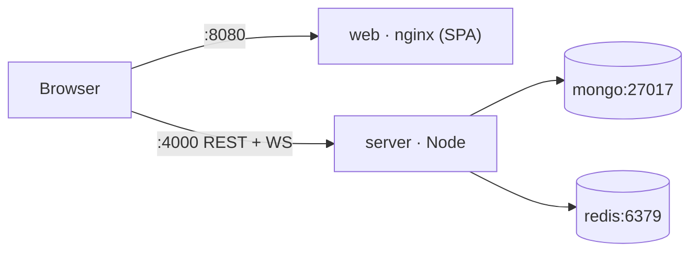

# Deployment

CollabBoard ships as a Docker Compose stack of four services and builds to two multi-stage
production images. This covers local compose usage, the images, environment, and what to change
for a real production deployment (secrets, HTTPS, scaling).

- [Compose stack](#compose-stack)
- [Images](#images)
- [Environment](#environment)
- [Production notes](#production-notes)
- [Scaling with multiple replicas](#scaling-with-multiple-replicas)

---

## Compose stack

`docker-compose.yml` defines four services:

| Service | Image | Ports (host→container) | Notes |
|---|---|---|---|
| `mongo` | `mongo:7` | `27017:27017` | named volume `mongo-data`; healthcheck via `mongosh ping` |
| `redis` | `redis:7-alpine` | `6379:6379` | healthcheck via `redis-cli ping` |
| `server` | built from `apps/server/Dockerfile` | `4000:4000` | waits for mongo + redis healthy |
| `web` | built from `apps/web/Dockerfile` | `8080:80` | nginx-served SPA; waits for server |

```bash
npm run docker:up      # docker compose up --build
# open http://localhost:8080   (API at http://localhost:4000)
npm run docker:down    # docker compose down -v   (also removes volumes)
```

Seed demo data once the stack is up:

```bash
docker compose exec server npm run seed -w @collabboard/server
```

In compose, the server is wired for the containerised hostnames:
`MONGO_URI=mongodb://mongo:27017/collabboard`, `REDIS_URL=redis://redis:6379`,
`CLIENT_URL=http://localhost:8080`, and the web image is built with
`VITE_API_URL`/`VITE_SOCKET_URL = http://localhost:4000`.



---

## Images

Both are multi-stage and `node:20-alpine` based.

**Server** (`apps/server/Dockerfile`) — build stage installs workspace deps, copies
`packages/shared` + `apps/server`, and runs `tsup` (which inlines `@collabboard/shared`). The
runtime stage copies `node_modules` + `dist` and runs `node apps/server/dist/index.js`. It
declares a `HEALTHCHECK` that hits `/health`.

**Web** (`apps/web/Dockerfile`) — build stage runs `vite build` with the `VITE_*` values baked
in as **build args** (Vite inlines env at build time), then an `nginx:alpine` stage serves the
static `dist/`. `nginx.conf` long-caches hashed `/assets/`, gzips text assets, and does the SPA
fallback (`try_files … /index.html`) so client routes like `/board/:id` resolve.

> Because `VITE_API_URL`/`VITE_SOCKET_URL` are compile-time, point them at your real API origin
> **before building** the web image for a non-local deployment.

---

## Environment

Full table in the [README](../README.md#-environment-variables). Deployment-critical variables:

| Variable | Local default | Production |
|---|---|---|
| `NODE_ENV` | `development` | **`production`** |
| `CLIENT_URL` | `http://localhost:5173` | your web origin (CORS + email/share links) |
| `MONGO_URI` | local mongo | managed MongoDB URI |
| `REDIS_URL` | empty (single-node) | Redis URL (**required for >1 replica**) |
| `JWT_ACCESS_SECRET` / `JWT_REFRESH_SECRET` | dev secrets | **long random secrets** |
| `SHARE_LINK_SECRET` | dev secret | long random secret |
| `COOKIE_SECURE` | `false` | **`true`** (HTTPS-only cookie) |
| `COOKIE_DOMAIN` | `localhost` | your cookie domain |
| `SMTP_*` | empty (console mailer) | real SMTP for verification/invite email |
| `AI_SERVICE_URL` | empty (mock) | external action-item service, if any |

The server **refuses to boot** on invalid config — `config/env.ts` validates every variable with
Zod and exits non-zero with a clear message rather than failing later at request time.

---

## Production notes

**Secrets.** Replace every `*_SECRET` with a long random value (e.g. `openssl rand -base64 48`)
and inject via your platform's secret store — never commit them. The compose file only supplies
`dev-*` fallbacks for local convenience.

**HTTPS + cookies.** Terminate TLS at a load balancer / reverse proxy in front of the server.
Set `COOKIE_SECURE=true` so the refresh cookie is HTTPS-only. The app already sets
`trust proxy: 1`, so rate-limit IPs and cookies work correctly behind one proxy hop. Keep the
web and API on the same site (or configure CORS/cookie domain accordingly) so the `sameSite=lax`
refresh cookie flows.

**Headers & limits.** `helmet` is enabled; `express.json` is capped at 6 MB (thumbnails/
snapshots); the API and auth rate limiters are active in production. Tune caps in
`middleware/rateLimit.ts` if needed.

**Persistence.** Point `MONGO_URI` at managed MongoDB with backups. Snapshots + the op-log are
the durable board state; the op-log self-compacts, but plan retention for long-lived
`Snapshot` history.

**Health & shutdown.** `/health` is a liveness probe (used by the server image's healthcheck).
`index.ts` handles `SIGINT`/`SIGTERM` gracefully: it stops accepting connections, **flushes all
in-memory boards to snapshots** (`boardDocs.flushAll()`), then disconnects Mongo and Redis — so
a rolling deploy doesn't lose in-flight edits.

**Logging.** Pino emits structured JSON in production (pretty-printed only in dev). Ship stdout
to your log aggregator.

---

## Scaling with multiple replicas

The server is horizontally scalable **once `REDIS_URL` is set** — see
[ARCHITECTURE › Horizontal scaling](ARCHITECTURE.md#horizontal-scaling).

1. **Provide Redis.** With `REDIS_URL` present, each replica enables the Socket.IO Redis
   adapter (cross-node room fan-out) and the `cb:yjs` pub/sub channel (CRDT convergence). Empty
   ⇒ single-node only.
2. **Run N server replicas** behind the load balancer. Sticky sessions are **not** required —
   REST is stateless (JWT) and Socket.IO's adapter handles cross-node delivery. If your LB
   defaults to strict WebSocket routing, plain round-robin is fine.
3. **Scale the web tier** freely — it's static files behind nginx.
4. **MongoDB is the source of truth.** A replica that doesn't hold a given board in memory
   rehydrates it from `latest snapshot + ops-since` on the next join, so boards migrate between
   nodes transparently.

```bash
# example: scale the API to 3 replicas (requires REDIS_URL set for the service)
docker compose up --build --scale server=3
```

> When scaling `server`, drop the fixed `4000:4000` host port mapping (or front the replicas
> with the load balancer) so the replicas don't contend for the same host port.
