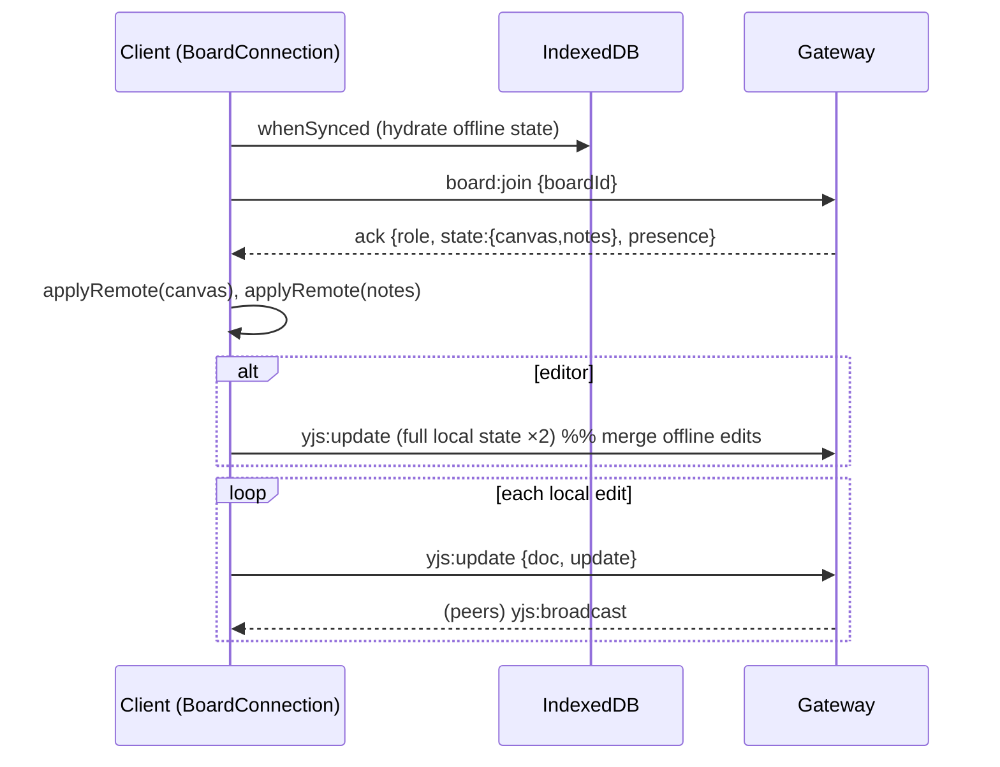

# Realtime protocol

CollabBoard's multiplayer layer is Socket.IO carrying **Yjs** CRDT updates (as base64
strings) plus presence and awareness. The wire protocol is defined once in
`packages/shared/src/socket/events.ts` and imported verbatim by both the server gateway
(`apps/server/src/realtime/gateway.ts`) and the client CRDT (`apps/web/src/lib/yjsBoard.ts`),
so a renamed event or changed payload is a compile error on both sides.

- [Connection & auth](#connection--auth)
- [Event reference](#event-reference)
- [Per-event authorization](#per-event-authorization)
- [Yjs sync flow](#yjs-sync-flow)
- [Presence](#presence)
- [Awareness](#awareness)
- [Offline & re-sync](#offline--resync)
- [Rooms](#rooms)

---

## Connection & auth

One shared Socket.IO connection per browser (`lib/socket.ts`). The **access token** is sent
via an `auth` **callback**, so every (re)connect picks up the freshest token:

```ts
io(SOCKET_URL, { autoConnect: false, withCredentials: true,
                 transports: ['websocket', 'polling'],
                 auth: (cb) => cb({ token: getAccessToken() ?? '' }) })
```

The gateway's connection middleware verifies the token (`handshake.auth.token`, falling back
to `handshake.query.token`) with `verifyAccessToken`. On failure it rejects with
`Error('UNAUTHORIZED')`. The client listens for that specific `connect_error`, performs a
**single-flight refresh** (`refreshAccessToken`), and reconnects once — surviving access-token
expiry mid-session. On success the gateway attaches `socket.data = { userId, name, color,
roles: {}, cursors: {} }` and joins the socket to its personal room `user:<userId>`.

---

## Event reference

Every event constant lives in `SOCKET_EVENTS`. "Ack" = a structured `Ack<T>` callback
(`{ ok: true, data } | { ok: false, error }`) — errors are returned, never thrown.

### Client → Server

| Event (`SOCKET_EVENTS`) | Wire name | Payload | Ack | Purpose |
|---|---|---|---|---|
| `BOARD_JOIN` | `board:join` | `{ boardId }` | `Ack<BoardJoinedPayload>` | Join a board room; returns role, both docs' base64 state, and current presence |
| `BOARD_LEAVE` | `board:leave` | `{ boardId }` | — | Leave a board room |
| `PRESENCE_CURSOR` | `presence:cursor` | `CursorPayload {boardId,x,y}` | — | Broadcast this socket's cursor (stage coords) |
| `YJS_UPDATE` | `yjs:update` | `YjsUpdatePayload {boardId,doc,update}` | `Ack` (optional) | Apply a Yjs update to a sub-document |
| `YJS_AWARENESS` | `yjs:awareness` | `AwarenessPayload {boardId,update}` | — | Relay a y-protocols awareness update (Tiptap carets) |
| `SNAPSHOT_CREATE` | `snapshot:create` | `SnapshotCreatePayload {boardId,label?}` | `Ack<{snapshotId}>` | Create a manual version snapshot (canvas + notes) |

### Server → Client

| Event (`SOCKET_EVENTS`) | Wire name | Payload | When |
|---|---|---|---|
| `BOARD_JOINED` | `board:joined` | `BoardJoinedPayload` | Defined in the protocol; the live join response is delivered via the `board:join` **ack** |
| `PRESENCE_STATE` | `presence:state` | `{ boardId, users: PresenceUser[] }` | Full snapshot **and** incremental cursor updates (single-user array) |
| `PRESENCE_JOIN` | `presence:join` | `{ boardId, user: PresenceUser }` | A peer joined the board room |
| `PRESENCE_LEAVE` | `presence:leave` | `{ boardId, socketId, userId }` | A peer left / disconnected |
| `YJS_BROADCAST` | `yjs:broadcast` | `YjsUpdatePayload` | An accepted update fanned out to other sockets |
| `AWARENESS_BROADCAST` | `awareness:broadcast` | `AwarenessPayload` | An awareness update fanned out to peers |
| `BOARD_ROLE_CHANGED` | `board:role-changed` | `{ boardId, role }` | The caller's role on a board changed (pushed by REST) |
| `BOARD_KICKED` | `board:kicked` | `{ boardId, reason }` | The caller was removed from a board (pushed by REST) |
| `SNAPSHOT_CREATED` | `snapshot:created` | `{ boardId, snapshotId, label }` | A snapshot was created (manual) |
| `ERROR` | `error` | `SocketErrorPayload {code,message,event?}` | A rejected event (e.g. a viewer attempting `yjs:update`) |

`PresenceUser = { userId, socketId, name, color, role, cursor: {x,y} | null }`.
`BoardJoinedPayload = { boardId, role, state: { canvas, notes }, presence }` where each
`state` value is a base64 `Y.encodeStateAsUpdate`.

---

## Per-event authorization

The gateway **re-authorizes every board-scoped event** through `services/access`
(`getBoardRole`) — it never trusts the client or a prior join. A short **per-socket TTL cache**
(20 s) avoids a DB round-trip per pen stroke; role upgrades/kicks bust the cache eagerly
(see [role changes](#role-changes--kicks)).

| Event | Minimum role | On failure |
|---|---|---|
| `board:join` | **viewer** | ack `FORBIDDEN` ("No access to this board") |
| `presence:cursor` | viewer | silently dropped (also requires already being in the room) |
| `yjs:update` | **editor** | emits `error {FORBIDDEN}` **and** ack `FORBIDDEN` ("View-only access") |
| `yjs:awareness` | viewer | silently dropped |
| `snapshot:create` | **editor** | ack `FORBIDDEN` ("Editor access required") |
| `board:leave` | — | idempotent room leave |

Because both REST and socket paths funnel through the **same** `services/access`, a socket
event can never be less strict than its REST equivalent. Writes (`yjs:update`,
`snapshot:create`) require `editor`; reads/presence require `viewer`.

---

## Yjs sync flow

Each board holds **two** independent Yjs documents: `canvas` (a `Y.Map<CanvasElement>` keyed
by element id) and `notes` (the Tiptap/ProseMirror XML fragment `default`). Concurrent edits
to different keys/positions are conflict-free by construction.

**Join / bootstrap**

1. Client waits for IndexedDB to hydrate, then emits `board:join`.
2. Gateway authorizes (viewer), joins the room, bumps `lastOpenedAt`, and returns
   `BoardJoinedPayload` with base64 state for both docs + the presence list.
3. Client applies both states locally (tagged `remote` so they don't echo back out), then —
   **if editor** — pushes its **full local state** so any offline edits merge server-side.

**Steady-state edit**

1. A local Konva/Tiptap mutation fires `doc.on('update')`; the client emits `yjs:update`.
2. Gateway authorizes (editor) → `BoardDocManager.applyLocalUpdate` (apply, append to op-log,
   publish to `cb:yjs`, schedule snapshot) → broadcasts `yjs:broadcast` to the rest of the room.
3. Peers apply the incoming update (tagged `remote`). The Socket.IO Redis adapter and the
   `cb:yjs` pub/sub together deliver it across nodes — see
   [ARCHITECTURE](ARCHITECTURE.md#real-time-edit-sequence).



---

## Presence

Cursor presence is separate from Yjs and rides the `PRESENCE_*` events:

- On stage `pointermove`, the client throttles to `LIMITS.CURSOR_THROTTLE_MS` (40 ms) and
  emits `presence:cursor {boardId,x,y}` in stage coordinates.
- The gateway records the cursor on `socket.data.cursors[boardId]` and emits `presence:state`
  to the room with a **single-element** `users` array (the mover), which peers merge into
  `boardStore.presence` (keyed by `socketId`).
- `presence:join` / `presence:leave` maintain the roster as peers come and go; on join the
  full `presence` list arrives inside the `board:join` ack.
- `presenceSnapshot(io, boardId)` builds the roster from `io.in(room).fetchSockets()`, so it is
  **adapter-aware** (spans all nodes) and **de-duped per user** (most-recent socket wins).

The client `boardStore` tracks only *peers* (never the local user) and exposes
`setPresence` / `upsertPresence` / `removePresenceBySocket` / `removePresenceByUser`.

### Role changes & kicks

When a board membership changes via REST, controllers call into the gateway:

- `emitRoleChanged(boardId, userId, role)` — refreshes that user's per-socket role cache and
  emits `board:role-changed` to `user:<userId>`, so the client flips editor/viewer live.
- `emitKicked(boardId, userId)` — clears the cache, force-leaves the room, and emits
  `board:kicked`; the client toasts and navigates back to `/app`.

---

## Awareness

Tiptap's collaborative **selection carets** use y-protocols awareness, carried on a dedicated
channel so they stay ephemeral (never persisted to the op-log):

- Client wires `CollaborationCursor` to `connection.awareness`; local awareness changes emit
  `yjs:awareness {boardId, update(b64)}`.
- Gateway relays to the room as `awareness:broadcast`; peers `applyAwarenessUpdate` (tagged
  `remote`).

So a board has **two** live-cursor systems: Konva canvas cursors via `presence:*`, and
rich-text carets via awareness — each optimized for its surface.

---

## Offline & re-sync

The client CRDT is offline-first (`lib/yjsBoard.ts`):

- Both Yjs docs are persisted to **IndexedDB** (`y-indexeddb`) under `cb-canvas-<boardId>` and
  `cb-notes-<boardId>`. Edits work with no network — they render locally and land in IndexedDB.
- Local updates whose `origin` is the network (`remote`) or IndexedDB are **not** re-emitted,
  preventing echo loops.
- On (re)connect the client waits for `whenSynced`, then re-joins and (if editor) pushes its
  **full local state**. Yjs merges it with the server state **conflict-free** — offline edits
  are never lost and never clobber concurrent remote edits.
- Connection status (`connecting | online | offline`) is surfaced via `connection.onStatus`
  and rendered by the board's `ConnectionBadge`.

---

## Rooms

| Room | Members | Used for |
|---|---|---|
| `board:<boardId>` | every socket that joined the board | Yjs broadcasts, presence, awareness |
| `user:<userId>` | all of a user's sockets | targeted `board:role-changed` / `board:kicked` |

Room emits are made cluster-wide by the Socket.IO Redis adapter when `REDIS_URL` is set; with
no Redis they stay in-process (single-node). Buffer size is raised
(`maxHttpBufferSize: 5e6`) to accommodate full-state Yjs pushes.
